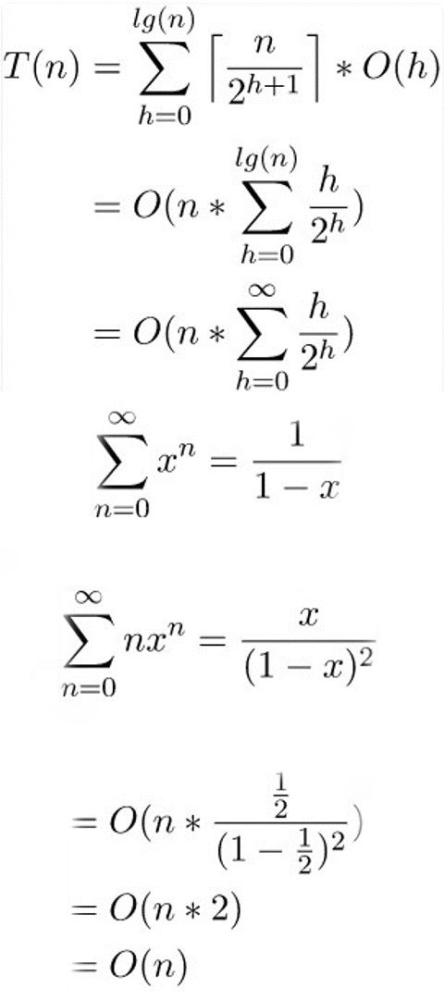

# Heap Sort

- time complexity: O(nlogn)

## Process
1. build max/min heap tree
2. take the first one and swap with the last one.
3. size of heap -= 1 
    (elements after this size is ordered and shouldn't be dealt again.)
4. adjust / heapify from top of the heap
5. go to step 2 if size of heap > 0

## Note and Tips
- Don't use index 0 in the implementation \
    If you use array in implementation, index 0 is not used beacause of the index manipulation. In the heapify, the left child's index is root * 2. When root is index 0, the left child is still 0. This will let the index 0 element not be dealt.

- When building the heap tree, heapify from the last parent node. \
    It will be O(n). See the proof: \
    
    where the heap size of n with height h has at most ⌈ n / (2^(h+1))⌉ nodes.

## maxHeapify recursive (c++)
```
void maxHeapify(vector<numAndCount> &array, int root, int lastIdexToCare){
    int left = 2 * root;
    int right = 2 * root + 1;
    int largest;

    if (left <= lastIdexToCare && array[left].count > array[root].count)
        largest = left;
    else
        largest = root;

    if (right <= lastIdexToCare && array[right].count > array[largest].count)
        largest = right;

    if (largest != root) {
        swap(array[largest], array[root]);
        maxHeapify(array, largest, lastIdexToCare);
    }
}
```